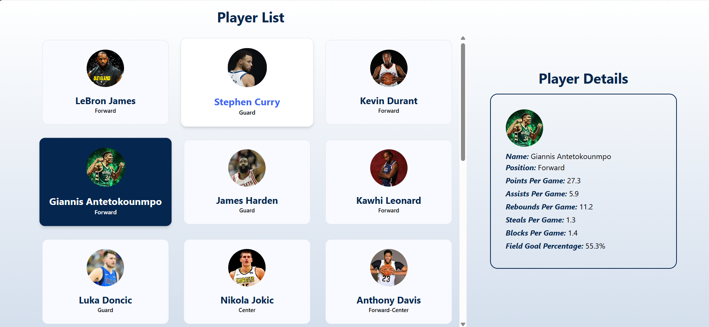
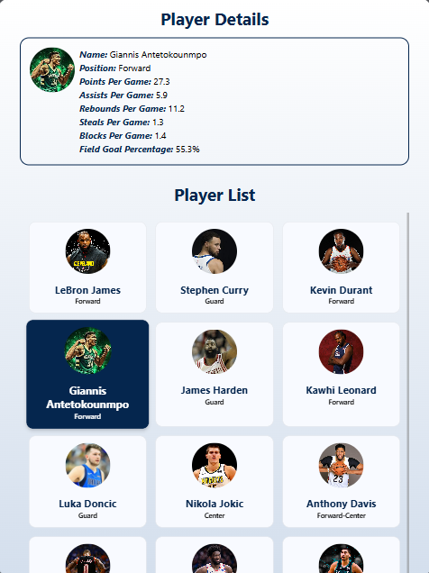
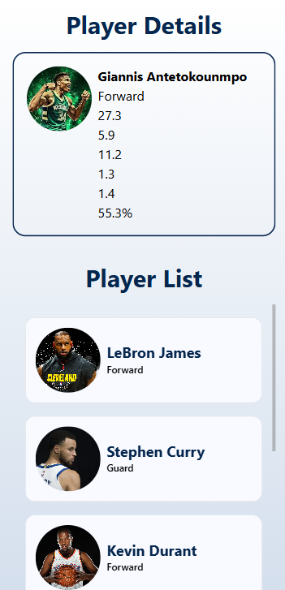

# React Basketball Player App

This is a simple React application that displays a list of basketball players and their details. The application consists of two main components: a list view for displaying player names and a details view for displaying more information about the selected player.

## Table of Contents

- Installation
- Usage
- Components
  - Home
  - PlayerList
  - PlayerDetails
- Data-Structure

## Installation

1. Clone the repository:
   ```bash
   git clone https://github.com/MrSahalImran/player.git
   cd player
   ```
2. Run the following command
   ```bash
   npm install
   npm run dev
   ```

## Usage

The application will display a list of basketball players. You can click on any player to see more details about them, including their position and game statistics.

### Desktop View



### Tablet View



### Moblie View



## Components

### Home

The Home component is the main component that orchestrates the application. It imports player data from a players.js file, manages the state for the selected player, and handles the display of loading and error states.

### PlayerList

The PlayerList component displays a list of players. It highlights the selected player and allows users to click on a player to see their details. It handles image loading errors gracefully by displaying the player's initials if the image fails to load.

### PlayerDetails

The PlayerDetails component displays detailed information about the selected player, including their name, position, and game statistics.

## Data Structure

The player data is imported from a players.js file. Each player object contains the following properties:

```json
    const players = [
  {
    name: "LeBron James",
    image: "https://images.hdqwalls.com/wallpapers/lebron-james-5k-xy.jpg",
    position: "Forward",
    stats: {
      pointsPerGame: 25.4,
      assistsPerGame: 7.1,
      reboundsPerGame: 10.5,
      stealsPerGame: 1.6,
      blocksPerGame: 0.8,
      fieldGoalPercentage: 51.3,
    },
  },
  // more...
];
```
